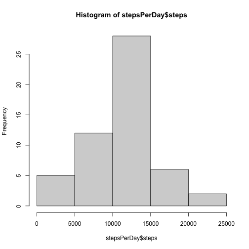
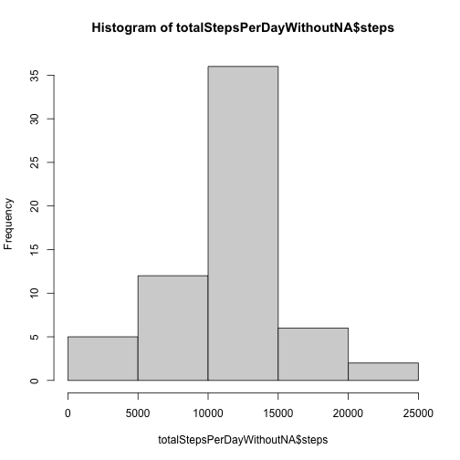
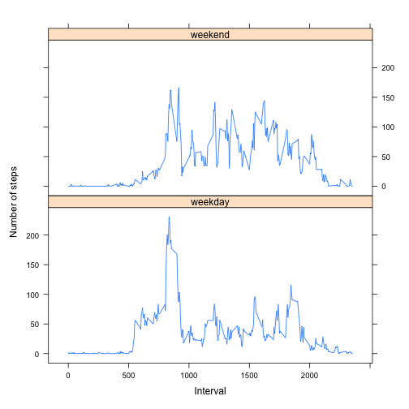

## Preparing the data

First we will load the data and do simple exploration:


```r
activityDataSet <- read.csv("activity.csv")
summary(activityDataSet)
```

```
##      steps            date              interval     
##  Min.   :  0.00   Length:17568       Min.   :   0.0  
##  1st Qu.:  0.00   Class :character   1st Qu.: 588.8  
##  Median :  0.00   Mode  :character   Median :1177.5  
##  Mean   : 37.38                      Mean   :1177.5  
##  3rd Qu.: 12.00                      3rd Qu.:1766.2  
##  Max.   :806.00                      Max.   :2355.0  
##  NA's   :2304
```

## What is mean total number of steps taken per day?
1. Calculate the total number of steps taken per day

```r
stepsPerDay <- aggregate(steps ~ date, activityDataSet, sum, na.rm=TRUE)
```

2. Histogram of the total number of steps taken each day

```r
hist(stepsPerDay$steps)
```



3. The mean and median of the total number of steps taken per day
The mean total number of steps taken each day is stored in variable meanStepsPerDay

```r
meanStepsPerDay <- mean(stepsPerDay$steps)
meanStepsPerDay
```

```
## [1] 10766.19
```
The median total number of steps taken each day is stored in variable medianStepsPerDay

```r
medianStepsPerDay <- median(stepsPerDay$steps)
medianStepsPerDay
```

```
## [1] 10765
```

## What is the average daily activity pattern?
1. Make a time series plot (i.e. 𝚝𝚢𝚙𝚎 = “𝚕”) of the 5-minute interval (x-axis) and the average number of steps taken, averaged across all days (y-axis)


```r
stepsPerInterval<-aggregate(steps~interval, data=activityDataSet, mean, na.rm=TRUE)
plot(steps~interval, data=stepsPerInterval, type="l")
```


2. Which 5-minute interval, on average across all the days in the dataset, contains the maximum number of steps?


```r
intervalWithMaxNbSteps <- stepsPerInterval[which.max(stepsPerInterval$steps),]$interval
intervalWithMaxNbSteps
```

```
## [1] 835
```

## Imputing missing values

1. Calculate and report the total number of missing values in the dataset (i.e. the total number of rows with NAs)

```r
totalValuesMissings <- sum(is.na(activityDataSet$steps))
totalValuesMissings
```

```
## [1] 2304
```

2. Devise a strategy for filling in all of the missing values in the dataset. The strategy does not need to be sophisticated. For example, you could use the mean/median for that day, or the mean for that 5-minute interval, etc.

In this case we will use a simple strategy of filling the missing values with mean value for that 5-minute interval


```r
getMeanStepsPerInterval<-function(interval){
    stepsPerInterval[stepsPerInterval$interval==interval,]$steps
}
```

3. Create a new dataset that is equal to the original dataset but with the missing data filled in.


```r
activityDataSetFull<-activityDataSet
for(i in 1:nrow(activityDataSetFull)){
    if(is.na(activityDataSetFull[i,]$steps)){
        activityDataSetFull[i,]$steps <- getMeanStepsPerInterval(activityDataSetFull[i,]$interval)
    }
}
```

The new data set with no missing values is contained in the variable activityDataSetFull

4. Make a histogram of the total number of steps taken each day and Calculate and report the mean and median total number of steps taken per day. Do these values differ from the estimates from the first part of the assignment? What is the impact of imputing missing data on the estimates of the total daily number of steps?


```r
totalStepsPerDayWithoutNA <- aggregate(steps ~ date, data=activityDataSetFull, sum)
hist(totalStepsPerDayWithoutNA$steps)
```



```r
meanStepsPerDayWithoutNA <- mean(totalStepsPerDayWithoutNA$steps)
meanStepsPerDayWithoutNA
```

```
## [1] 10766.19
```

```r
medianStepsPerDayWithoutNA <- median(totalStepsPerDayWithoutNA$steps)
medianStepsPerDayWithoutNA
```

```
## [1] 10766.19
```

The mean total number of steps taken each day with no missing values is stored in variable meanStepsPerDayWithoutNA
The median total number of steps taken each day with no missing values is stored in variable medianStepsPerDayWithoutNA

## Are there differences in activity patterns between weekdays and weekends?

1. Create a new factor variable in the dataset with two levels – “weekday” and “weekend” indicating whether a given date is a weekday or weekend day.


```r
activityDataSetFull$date <- as.Date(strptime(activityDataSetFull$date, format="%Y-%m-%d"))
activityDataSetFull$day <- weekdays(activityDataSetFull$date)
for (i in 1:nrow(activityDataSetFull)) {
    if (activityDataSetFull[i,]$day %in% c("Saturday","Sunday")) {
        activityDataSetFull[i,]$day<-"weekend"
    }
    else{
        activityDataSetFull[i,]$day<-"weekday"
    }
}
stepsByDay <- aggregate(activityDataSetFull$steps ~ activityDataSetFull$interval + activityDataSetFull$day, activityDataSetFull, mean)
```

2. Make a panel plot containing a time series plot (i.e. 𝚝𝚢𝚙𝚎 = “𝚕”) of the 5-minute interval (x-axis) and the average number of steps taken, averaged across all weekday days or weekend days (y-axis). See the README file in the GitHub repository to see an example of what this plot should look like using simulated data.


```r
names(stepsByDay) <- c("interval", "day", "steps")
library(lattice)
xyplot(steps ~ interval | day, stepsByDay, type = "l", layout = c(1, 2), 
    xlab = "Interval", ylab = "Number of steps")
```


